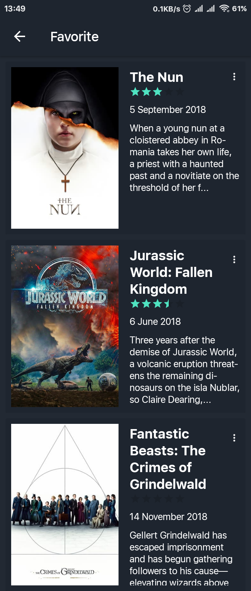

# SLEK-e

Aplikasi dibuat dengan menggunakan bahasa pemrograman <a href="https://en.wikipedia.org/wiki/Java_(programming_language)">Java</a> dan menggunakan <a href="https://developer.android.com/studio/">Android Studio</a> serta menggunakan <a href="https://en.wikipedia.org/wiki/Application_programming_interface">API</a> dari <a href="https://www.themoviedb.org/">The Movie Database (TMDb)</a>. Aplikasi ini merupakan pengembangan dari submission Kelas <a href="https://www.dicoding.com/academies/14">Menjadi Android Developer Expert</a> Dicoding (Project Catalogue Movie : Extended Application) tanpa menyertakan <a href="https://developer.android.com/guide/topics/appwidgets/overview">Widget</a>

# Tampilan Aplikasi

# Library
- <a href="https://square.github.io/retrofit/">Retrofit</a>
- <a href="https://bumptech.github.io/glide/">Glide</a>
- <a href="https://github.com/hdodenhof/CircleImageView">CircleImageView</a>
- <a href="https://developer.android.com/topic/libraries/support-library/packages">Android Support Library Package V7</a>
